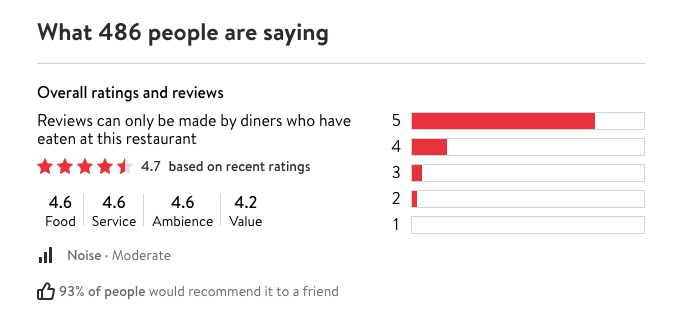

# Data sources
We are using two datasets for our project. The first one is an inspection results data, where we downloaded the dataset from the [official website](https://data.cityofnewyork.us/Health/Restaurant-Grades/gra9-xbjk).

The second dataset is restaurant review dataset during last restaurant week. We scraped this dataset from Opentable using rvest. We first get the name of restaurants participating in the NYC restaurant week. 

Then we use the name we got to scrape detailed information that we need.  The scraped data contains 9 columns: food_review,	ambience_review	value_review,	service_review,	price_range	review_count,	average_review,	restaurant_main_type. The detailed information like review scores are scraped from the restaurant page.     
 


The way we scraped data was that we restrict the region into Manhattan area so that most restaurants will appear in the health inspection data. Since there are 3 pages of restaurants, we used url to do page indexing. Then we constructed a loop with page numbers. In side this loop we have a nested loop that use the restaurant names we got froim this page to modify the url. We did some regex on the names so that they can fit the way opentable use them. For each column we append each value into a list. After we finish the nested loop, we will combine all the lists we have into our final dataset. Following is the code for our scaping script:
```{r eval=FALSE}
library(rvest)
library(stringr)
library(robotstxt)

opentable_data<-data.frame(
  "name"=c(),
  "food_review"=c(),
  "ambience_review"=c(),
  "value_review"=c(),
  "service_review"=c(),
  "price_range"=c(),
  "review_count"=c(),
  "average_review"=c(),
  "restaurant_main_type"=c()
)

name_res=c()
food=c()
ambience=c()
service=c()
value=c()
avg=c()
num_rev=c()
price=c()
type=c()

for (i in 0:2){
  num=i*100
  num=toString(num)
  count=0
  url="https://www.opentable.com/promo.aspx?covers=2&currentview=list&datetime=2020-12-05+19%3A00&latitude=40.80131&longitude=-73.981569&metroid=8&promoid=69&ref=412&size=100&sort=Popularity&from=#"
  print(num)
  url=str_replace(url,"#",num)
  print(url)
  restaurant_name <- read_html(url)%>%
    html_nodes('.rest-row-name-text') %>%
    html_text()%>%
    substring(first=1)

  print(restaurant_name)
  restaurant_name_url=str_replace_all(restaurant_name, "[']", "")
  restaurant_name_url=str_replace_all(restaurant_name_url, "[&]", "and")
  restaurant_name_url=str_replace_all(restaurant_name_url, " - ", "-")
  restaurant_name_url=str_replace_all(restaurant_name_url, " ", "-")
  restaurant_name_url=str_replace_all(restaurant_name_url, "-New-York-City", "")
  restaurant_name_url=str_replace_all(restaurant_name_url, "-New-York", "")
  restaurant_name_url=tolower(restaurant_name_url)
  for (name in restaurant_name_url) {
    count=count+1
    if (substring(name, 1, 1)=="-"){
      name=str_replace(name,"-","")
    }

    sub_url="https://www.opentable.com/r/#-new-york?avt=eyJ2IjoyLCJtIjoxLCJwIjowLCJzIjowLCJuIjowfQ&corrid=7235a56e-23e8-43c8-bd3b-4911be2d7b7d&p=2&pid=69&ref=412&sd=2020-12-05+19%3A00"
    sub_url = str_replace(sub_url,"[#]",name)

    skip_to_next <- FALSE

    # Note that print(b) fails since b doesn't exist

    tryCatch(webpage555<-read_html(sub_url), error = function(e) { skip_to_next <<- TRUE

    })

    if(skip_to_next==TRUE) { next }

    rating <- read_html(sub_url)%>%
      html_nodes('.oc-reviews-15d38b07')%>%
      html_text()
    general_info <- read_html(sub_url)%>%
      html_nodes('.c3981cf8._965a91d5')%>%
      html_text()

    name_res=append(name_res, restaurant_name[count])
    food=append(food, rating[1])
    service=append(service, rating[2])
    ambience=append(ambience, rating[3])
    value=append(value, rating[4])

    avg=append(avg, general_info[length(general_info)-3])
    num_rev=append(num_rev, general_info[length(general_info)-2])
    price=append(price, general_info[length(general_info)-1])
    type=append(type, general_info[length(general_info)])
  }


}

opentable_data<-data.frame(
  "name"=name_res,
  "food_review"=food,
  "ambience_review"=ambience,
  "value_review"=value,
  "service_review"=service,
  "price_range"=price,
  "review_count"=num_rev,
  "average_review"=avg,
  "restaurant_main_type"=type
)
write.csv(opentable_data, "./opentable.csv")

```

There is not scraping process for our inspection data. The data contains grade, score, date of the inspection, violation description and the restaurant name. Our further task is to join these two datasets, and explore some interesting relationship between these two. 